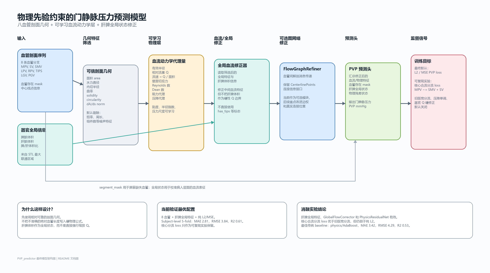
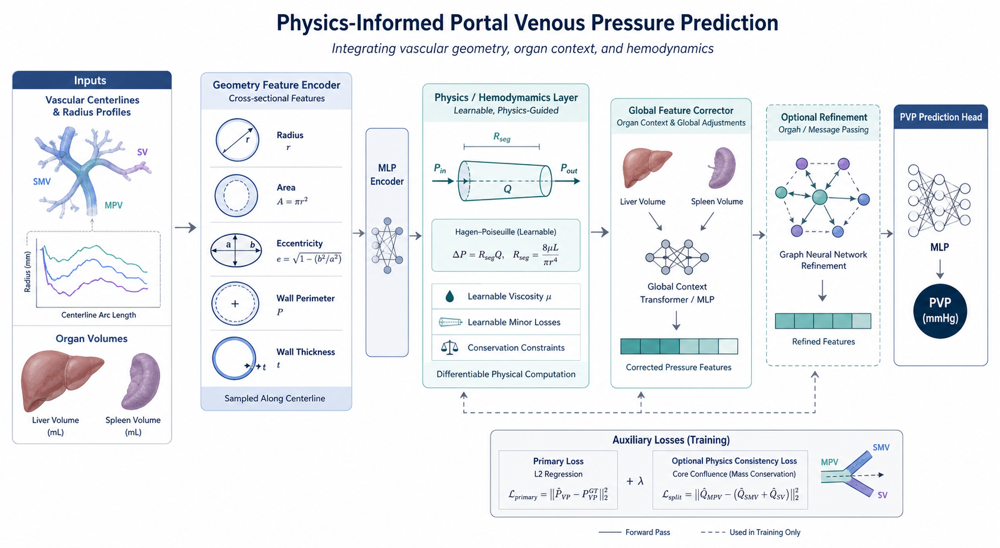

# PVP Predictor 门静脉压力预测模型

本项目用于基于门静脉系统血管剖面几何、肝脾器官全局信息和可学习血流动力学代理量预测门静脉压力（portal venous pressure, PVP）。

当前最终模型由 72 个有效样本的 subject-level 5-fold 验证结果选出。最终推荐配置为：

```text
8 血管剖面几何
+ 肝脾体积全局特征
+ GlobalFlowCorrector
+ PhysicsResidualNet
+ 纯 L2/MSE 监督
```



上图为当前最终模型架构图，可通过 [docs/draw_model_architecture.py](docs/draw_model_architecture.py) 重新生成。图片文件位于 [docs/figures/model_architecture.png](docs/figures/model_architecture.png)。

下面是通过 imagegen 生成的期刊风格架构参考图，用于展示更接近顶刊图形摘要的视觉风格：



## 模型架构

### 输入血管

当前最终模型使用 8 条血管：

```text
mpv, sv, smv, lpv, rpv, tips, lgv, pgv
```

其中：

| 缩写 | 含义 |
|---|---|
| `mpv` | 门静脉主干 |
| `sv` | 脾静脉 |
| `smv` | 肠系膜上静脉 |
| `lpv` | 肝门左支 |
| `rpv` | 肝门右支 |
| `tips` | TIPS 手术管 |
| `lgv` | 胃左静脉 |
| `pgv` | 胃后静脉 |

血管是否存在由 `segment_mask` 和剖面有效数据表示。`has_tips`、`has_lgv`、`has_pgv` 这类存在标志不直接作为辅助输入，因为它们可以从剖面数据和 `segment_mask` 中体现。

### 剖面几何特征

默认只使用相对可信、物理含义明确的剖面几何：

| 特征 | 中文说明 | 用途 |
|---|---|---|
| `area` | 截面积 | 计算流速、有效半径、阻力代理 |
| `hydraulic_diameter` | 水力直径 | 描述血管口径 |
| `inscribed_radius` | 内切半径 | 支持有效半径估计 |
| `curvature` | 曲率 | 表征弯曲导致的二次流影响 |
| `solidity` | 实心度 | 描述截面规则性 |
| `circularity` | 圆形度 | 描述截面形状紧凑程度 |
| `dA_ds_norm` | 归一化面积沿程变化 | 描述沿血管方向的截面积变化 |

默认不使用 `torsion`、`perimeter`、`r_insc_to_r_eq_ratio`、`n_components` 等噪声较大或稳定性不足的特征。SMV、LPV、RPV 等血管的原始绝对长度也不进入硬物理公式，因为这些血管容易受到小分支截断和提取不完整的影响。

### 肝脾全局特征

当前模型将肝脏和脾脏体积作为病人层面的全局状态输入：

```text
spleen_volume_ml
liver_volume_ml
spleen_liver_ratio
```

肝脾体积来自 STL 最大联通区域，缓存文件为：

```text
runs/stl_largest_component_volume_cache.json
```

重要结论：肝脾体积不作为硬性的入口流量修正项，而是作为全局特征输入模型。消融结果显示，这种方式比直接用器官体积修正 Q 更稳定。

### 可学习物理层

模型先从剖面几何计算血流动力学代理量，再交给后续网络修正。主要中间量包括：

| 中间量 | 说明 |
|---|---|
| 有效半径 | 由截面积和内切半径共同估计 |
| 相对流量 `Q` | 模型内部学习的分支相对流量状态 |
| 流速 | 由 `Q / area` 得到的代理量 |
| 壁面切应力 | 黏性剪切相关代理 |
| Reynolds 数 | 惯性流动相关代理 |
| Dean 数 | 曲率和二次流相关代理 |
| 阻力代理 | Poiseuille 近似启发的阻力项 |
| 压降代理 | 沿程累计压降代理 |

黏度尺度、半径指数、压力尺度、有效长度尺度等不是完全写死的常数，而是可学习参数，并限制在稳定范围内。这样可以保留物理方向，同时避免错误的绝对长度或手工常数把模型带偏。

### 全局修正与预测头

`GlobalFlowCorrector` 使用筛选后的全局特征和肝脾体积修正中间血流特征。`PhysicsResidualNet` 在物理代理量基础上学习残差修正。最终 `PVP prediction head` 汇总血流特征、`segment_mask`、肝脾全局状态和物理残差状态，输出 PVP（mmHg）。

`FlowGraphRefiner` 保留为可选图网络模块，用于血管间解剖消息传递。当前版本已经保留 CenterlinePoints 连接信息接口，但从现有消融结果看，GNN 还没有稳定提升性能，后续应重点改进真实连接位置和边权建模。

### 训练目标

当前最终默认训练目标为纯 L2/MSE：

```text
L = MSE(PVP_pred, PVP_true)
```

同时保留一个可复现实验用的核心合流分流约束：

```text
MPV ~= SMV + SV
```

运行方式：

```bash
--lambda_press 0.03 --split_loss_mode core_confluence
```

实验结果显示，核心合流分流约束比旧版宽分流约束更合理，但仍没有超过纯 L2/MSE，因此不作为最终默认 loss。

## 实验结果

### 数据与验证方式

| 项目 | 数值 |
|---|---:|
| 数据路径 | `F:\PCG data\dataset\test4all_sample` |
| 有效样本 | 72 scans |
| 受试者数量 | 50 subjects |
| 验证方式 | subject-level 5-fold |
| 评价指标 | MAE, RMSE, R2 |

### 最终模型与 baseline 对比

传统 baseline 中表现最好的是 `physics/AdaBoost`。最终深度模型相对该 baseline 的 MAE 降低约 17.8%，RMSE 降低约 10.3%。

| 方法 | 特征集 | MAE | RMSE | R2 | 说明 |
|---|---|---:|---:|---:|---|
| 均值预测 | 标签均值 | 5.285 | 6.267 | -0.003 | 基础 sanity baseline |
| ExtraTrees | 几何特征 | 3.685 | 4.550 | 0.472 | 几何特征中 MAE 最好 |
| AdaBoost | 物理代理特征 | 3.420 | 4.286 | 0.531 | 最佳传统 baseline |
| ExtraTrees | 辅助/全局特征 | 3.730 | 4.532 | 0.476 | 全局特征 baseline |
| ElasticNetCV | 综合特征 | 3.641 | 4.481 | 0.487 | 几何 + 物理 + 辅助特征 |
| **最终模型** | **深度物理先验几何模型** | **2.810** | **3.843** | **0.614** | 当前最佳结果 |

baseline 结果文件：

```text
baseline/runs/final_20260607_baselines_72_seed40/summary.csv
baseline/runs/final_20260607_baselines_72_seed40/summary.json
```

### Loss 消融实验

最新 loss 消融聚焦于核心合流分流约束：

| 方案 | MAE | RMSE | R2 | 结论 |
|---|---:|---:|---:|---|
| **L2 only + 肝脾全局特征** | **2.810** | **3.843** | **0.614** | 最终默认 |
| L2 + 核心合流分流 loss | 2.887 | 3.941 | 0.595 | 比旧分流更好，但仍弱于纯 L2 |
| L2 + 旧版宽分流 loss | 3.022 | 4.140 | 0.556 | 约束过宽，效果最差 |

结果文件：

```text
ablation/runs/loss_ablation_core_split_20260607/full/comparison.csv
ablation/runs/loss_ablation_core_split_20260607/full/analysis.md
```

分析：旧版分流 loss 同时约束 LGV、PGV、TIPS 和肝内分支，对 TIPS 术后和存在代偿血管的样本过于僵硬。收窄为 MPV/SMV/SV 核心合流后负面影响变小，但模型已有的相对流量构造和肝脾全局状态已经捕捉到大部分相关信息，因此该物理约束仍未带来额外收益。

### 模型结构与特征消融

下表来自之前的架构诊断实验。该实验仍保留用于模块分析；最终默认配置以最新 loss 消融为准。

| 消融项 | MAE | RMSE | R2 | 解释 |
|---|---:|---:|---:|---|
| 宽分流参考模型 | 3.022 | 4.140 | 0.556 | 历史架构诊断参考 |
| 去掉肝脾全局特征 | 3.084 | 4.222 | 0.528 | 肝脾体积作为全局特征有效 |
| 去掉 GlobalFlowCorrector | 3.417 | 4.559 | 0.463 | 全局修正模块重要 |
| 去掉 PhysicsResidualNet | 3.268 | 4.218 | 0.538 | 物理残差修正有效 |
| 去掉 FlowGraphRefiner | 2.998 | 4.039 | 0.578 | 当前 GNN 实现未稳定提升 |
| 固定物理参数 | 2.922 | 4.192 | 0.548 | 指标混合，保留可学习标定 |
| 使用全部剖面特征 | 3.058 | 3.919 | 0.602 | RMSE/R2 改善但 MAE 变差，暂不默认 |
| 使用不可靠原始长度 | 2.895 | 4.022 | 0.580 | 有潜力，但不进入硬物理公式 |
| 6 血管布局 | 3.005 | 4.187 | 0.548 | 指标混合，不替代 8 血管 |
| 3 血管布局 | 3.106 | 4.194 | 0.536 | 弱于 8 血管 |

结果文件：

```text
ablation/runs/arch_ablation_l2_fullsplit_20260607/full/comparison.csv
ablation/runs/arch_ablation_l2_fullsplit_20260607/full/analysis.md
```

### 实验结论

| 问题 | 当前结论 |
|---|---|
| 肝脾体积是否有用？ | 有用，但应作为全局特征，而不是硬性 Q 边界修正。 |
| 最终 loss 用纯 L2 还是物理 split loss？ | 当前纯 L2/MSE 最好。 |
| 是否使用所有剖面几何？ | 不默认使用，保留可信剖面几何子集。 |
| 原始血管长度是否进入物理公式？ | 不进入硬物理公式，可作为后续学习特征候选。 |
| 是否压缩到 3 或 6 条血管？ | 当前不推荐，8 血管仍是最终默认。 |
| GNN 是否已经成熟？ | 还没有，后续需要用 CenterlinePoints 的真实连接位置和边权重重新设计。 |

## 使用方法

### 训练最终 PVP 模型

```bash
conda run -n pytorch python train.py ^
  --data_root "F:\PCG data\dataset\test4all_sample" ^
  --out_dir runs\final_pvp_8v_organ_global_l2 ^
  --no_organ_flow_scale ^
  --lambda_press 0
```

### 运行核心合流分流 loss 对照

```bash
conda run -n pytorch python train.py ^
  --data_root "F:\PCG data\dataset\test4all_sample" ^
  --out_dir runs\pvp_8v_organ_global_l2_core_split ^
  --no_organ_flow_scale ^
  --lambda_press 0.03 ^
  --split_loss_mode core_confluence
```

### 运行 loss 消融

```bash
conda run -n pytorch python ablation/ablations.py ^
  --suite loss ^
  --stage full ^
  --out_root ablation/runs/loss_ablation_core_split_20260607 ^
  --full_n_folds 5 ^
  --full_epochs 300 ^
  --seed 40 ^
  --force
```

### 运行传统 baseline

```bash
conda run -n pytorch python baseline/run_baselines.py ^
  --data_root "F:\PCG data\dataset\test4all_sample" ^
  --out_dir baseline/runs/final_20260607_baselines_72_seed40 ^
  --n_points 200
```

### 重新生成中文架构图

```bash
conda run -n pytorch python docs/draw_model_architecture.py
```

## 目录结构

```text
dataset.py                         数据集、特征读取、器官体积缓存
model.py                           最终物理先验 PVP/CSPH 模型
train.py                           训练与交叉验证入口
baseline/                          传统机器学习 baseline 和旧模型备份
ablation/                          消融实验与报告工具
ablation/runs/                     保留的最终实验结果
docs/draw_model_architecture.py     中文架构图绘制脚本
docs/figures/                      README 图片
FINAL_20260607_RESULTS_ANALYSIS.md  中文最终实验分析
```

## 当前推荐方案

当前数据集上推荐使用：

```text
8 血管模型
+ 肝脾体积全局特征
+ GlobalFlowCorrector
+ PhysicsResidualNet
+ 纯 L2/MSE loss
```

核心合流分流 loss 可作为论文补充实验或负结果报告：它比旧版宽分流更符合解剖逻辑，但在当前数据上仍未改善 MAE、RMSE 或 R2。
